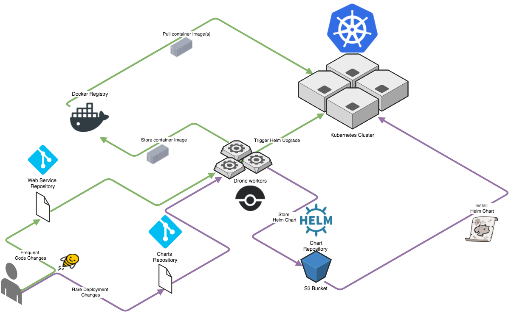

# Sane environment for your kubernetes tools

[](https://badge.fury.io/js/tslint-config-swimlane)

[Configure Access to Multiple Clusters](https://kubernetes.io/docs/tasks/access-application-cluster/configure-access-multiple-clusters/#define-clusters-users-and-contexts)

## Running

Mount your local KUBECONFIG directory when running
(`--volume ~/.kube:/workspace/.kube`)

```bash
docker run  --rm -it                            \
            --volume ~/.kube:/workspace/.kube   \
            appsoa/docker-alpine-k8-devenv      \
            /bin/bash
```

## Batteries Included

* [helm cli](https://github.com/kubernetes/helm)
* [deis cli](https://deis.com/docs/workflow/quickstart/install-cli-tools)
* [draft cli](https://github.com/azure/draft)

## More Reading

* helm charts: https://kubeapps.com/
